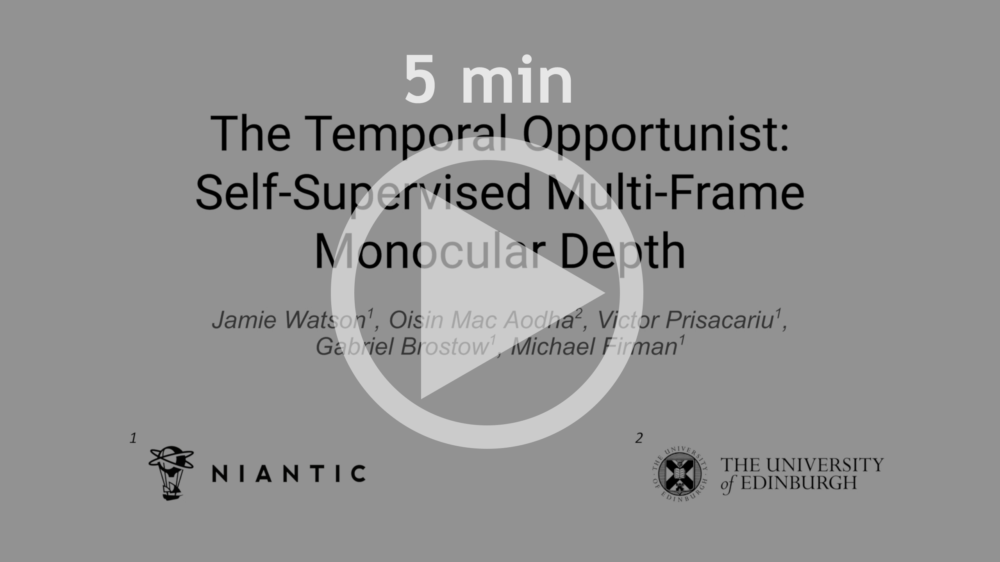
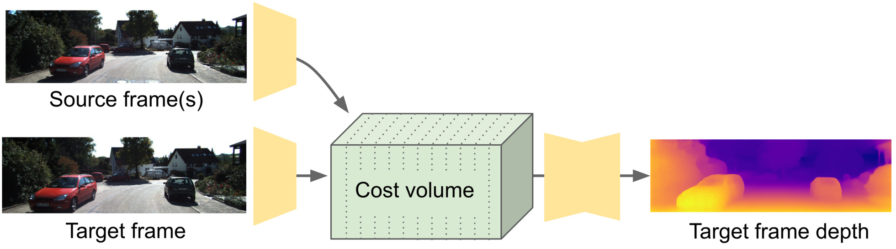
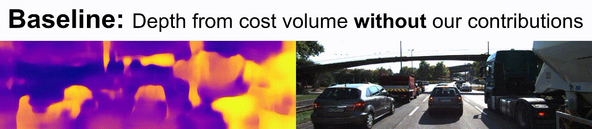
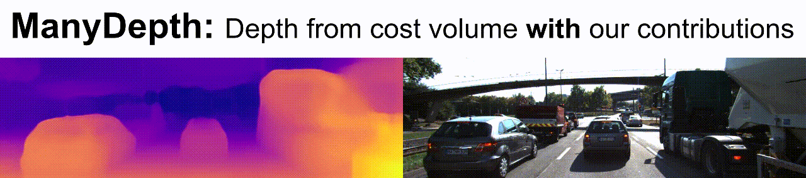
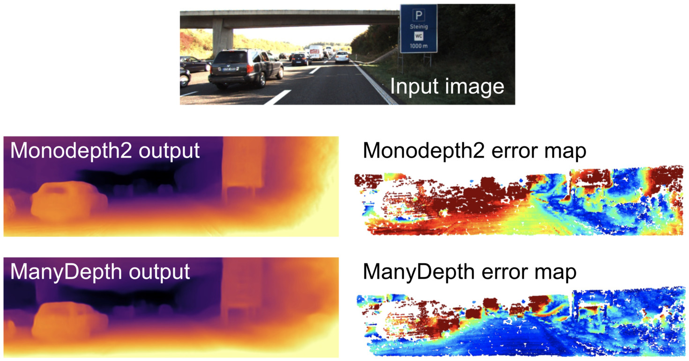
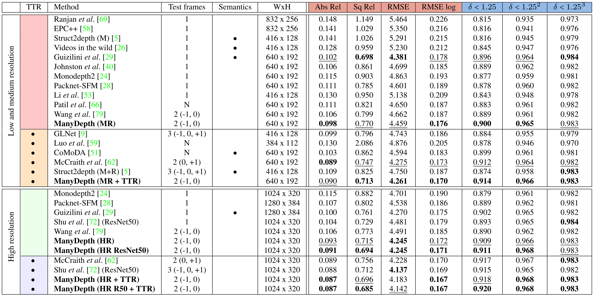

# The Temporal Opportunist: Self-Supervised Multi-Frame Monocular Depth

[Jamie Watson](https://scholar.google.com/citations?user=5pC7fw8AAAAJ&hl=en),
[Oisin Mac Aodha](https://homepages.inf.ed.ac.uk/omacaod/),
[Victor Prisacariu](https://www.robots.ox.ac.uk/~victor/),
[Gabriel J. Brostow](http://www0.cs.ucl.ac.uk/staff/g.brostow/) and
[Michael Firman](http://www.michaelfirman.co.uk) – **CVPR 2021**

[[Link to paper]](https://arxiv.org/abs/2104.14540)

We introduce ***ManyDepth***, an adaptive approach to dense depth estimation that can make use of sequence information at test time, when it is available.

* ✅ **Self-supervised**: We train from monocular video only. No depths or poses are needed at training or test time.
* ✅ Good depths from single frames; even better depths from **short sequences**.
* ✅ **Efficient**: Only one forward pass at test time. No test-time optimization needed.
* ✅ **State-of-the-art** self-supervised monocular-trained depth estimation on KITTI and CityScapes.


<p align="center">
  <a
href="https://storage.googleapis.com/niantic-lon-static/research/manydepth/manydepth_cvpr_cc.mp4">
  
  </a>
</p>


## Overview

Cost volumes are commonly used for estimating depths from multiple input views:

<p align="center">
  
</p>

However, cost volumes do not easily work with self-supervised training.

<p align="center">
  
</p>

In our paper, we:

* Introduce an adaptive cost volume to deal with unknown scene scales
* Fix problems with moving objects
* Introduce augmentations to deal with static cameras and start-of-sequence frames

These contributions enable cost volumes to work with self-supervised training:

<p align="center">
  
</p>

With our contributions, short test-time sequences give better predictions than methods which predict depth from just a single frame.

<p align="center">
  
</p>

## ✏️ 📄 Citation

If you find our work useful or interesting, please cite our paper:

```latex
@inproceedings{watson2021temporal,
    author = {Jamie Watson and
              Oisin Mac Aodha and
              Victor Prisacariu and
              Gabriel Brostow and
              Michael Firman},
    title = {{The Temporal Opportunist: Self-Supervised Multi-Frame Monocular Depth}},
    booktitle = {Computer Vision and Pattern Recognition (CVPR)},
    year = {2021}
}
```

## 📈 Results

Our **ManyDepth** method outperforms all previous methods in all subsections across most metrics, whether or not the baselines use multiple frames at test time.
See our paper for full details.

<p align="center">
  
</p>

## 👀 Reproducing Paper Results

To recreate the results from our paper, run:

```bash
CUDA_VISIBLE_DEVICES=<your_desired_GPU> \
python -m manydepth.train \
    --data_path <your_KITTI_path> \
    --log_dir <your_save_path>  \
    --model_name <your_model_name>
```

Depending on the size of your GPU, you may need to set `--batch_size` to be lower than 12. Additionally you can train
a high resolution model by adding `--height 320 --width 1024`.

For instructions on downloading the KITTI dataset, see [Monodepth2](https://github.com/nianticlabs/monodepth2)

To train a CityScapes model, run:

```bash
CUDA_VISIBLE_DEVICES=<your_desired_GPU> \
python -m manydepth.train \
    --data_path <your_preprocessed_cityscapes_path> \
    --log_dir <your_save_path>  \
    --model_name <your_model_name> \
    --dataset cityscapes_preprocessed \
    --split cityscapes_preprocessed \
    --freeze_teacher_epoch 5 \
    --height 192 --width 512
```

Note here the `--freeze_teacher_epoch 5` command - we found this to be important for Cityscapes models, due to the large number of images in the training set. 

This assumes you have already preprocessed the CityScapes dataset using SfMLearner's [prepare_train_data.py](https://github.com/tinghuiz/SfMLearner/blob/master/data/prepare_train_data.py) script.
We used the following command:

```bash
python prepare_train_data.py \
    --img_height 512 \
    --img_width 1024 \
    --dataset_dir <path_to_downloaded_cityscapes_data> \
    --dataset_name cityscapes \
    --dump_root <your_preprocessed_cityscapes_path> \
    --seq_length 3 \
    --num_threads 8
```

Note that while we use the `--img_height 512` flag, the `prepare_train_data.py` script will save images which are `1024x384` as it also crops off the bottom portion of the image.
You could probably save disk space without a loss of accuracy by preprocessing with `--img_height 256 --img_width 512` (to create `512x192` images), but this isn't what we did for our experiments.

## 💾 Pretrained weights and evaluation

You can download weights for some pretrained models here:

* [KITTI MR (640x192)](https://storage.googleapis.com/niantic-lon-static/research/manydepth/models/KITTI_MR.zip)
* [KITTI HR (1024x320)](https://storage.googleapis.com/niantic-lon-static/research/manydepth/models/KITTI_HR.zip)
* [CityScapes (512x192)](https://storage.googleapis.com/niantic-lon-static/research/manydepth/models/CityScapes_MR.zip)

To evaluate a model on KITTI, run:

```bash
CUDA_VISIBLE_DEVICES=<your_desired_GPU> \
python -m manydepth.evaluate_depth \
    --data_path <your_KITTI_path> \
    --load_weights_folder <your_model_path>
    --eval_mono
```

Make sure you have first run `export_gt_depth.py` to extract ground truth files.

And to evaluate a model on Cityscapes, run:

```bash
CUDA_VISIBLE_DEVICES=<your_desired_GPU> \
python -m manydepth.evaluate_depth \
    --data_path <your_cityscapes_path> \
    --load_weights_folder <your_model_path>
    --eval_mono \
    --eval_split cityscapes
```

During evaluation, we crop and evaluate on the middle 50% of the images.

We provide ground truth depth files [HERE](https://storage.googleapis.com/niantic-lon-static/research/manydepth/gt_depths_cityscapes.zip),
which were converted from pixel disparities using intrinsics and the known baseline. Download this and unzip into `splits/cityscapes`.


If you want to evaluate a teacher network (i.e. the monocular network used for consistency loss), then add the flag `--eval_teacher`. This will 
load the weights of `mono_encoder.pth` and `mono_depth.pth`, which are provided for our KITTI models. 

## 🖼 Running on your own images

We provide some sample code in `test_simple.py` which demonstrates multi-frame inference.
This predicts depth for a sequence of two images cropped from a [dashcam video](https://www.youtube.com/watch?v=sF0wXxZwISw).
Prediction also requires an estimate of the intrinsics matrix, in json format.
For the provided test images, we have estimated the intrinsics to be equivalent to those of the KITTI dataset.
Note that the intrinsics provided in the json file are expected to be in [normalised coordinates](https://github.com/nianticlabs/monodepth2/issues/6#issuecomment-494407590).

Download and unzip model weights from one of the links above, and then run the following command:

```bash
python -m manydepth.test_simple \
    --target_image_path assets/test_sequence_target.jpg \
    --source_image_path assets/test_sequence_source.jpg \
    --intrinsics_json_path assets/test_sequence_intrinsics.json \
    --model_path path/to/weights
```

A predicted depth map rendering will be saved to `assets/test_sequence_target_disp.jpeg`.

## 👩‍⚖️ License

Copyright © Niantic, Inc. 2021. Patent Pending.
All rights reserved.
Please see the [license file](LICENSE) for terms.
